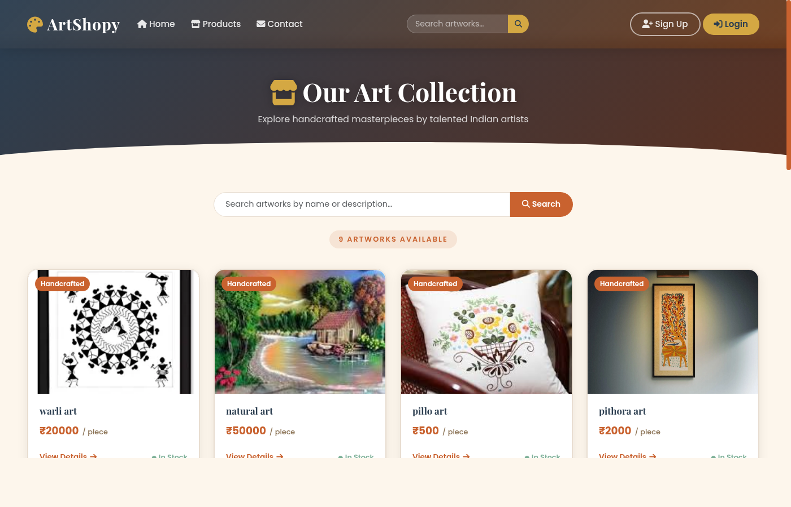
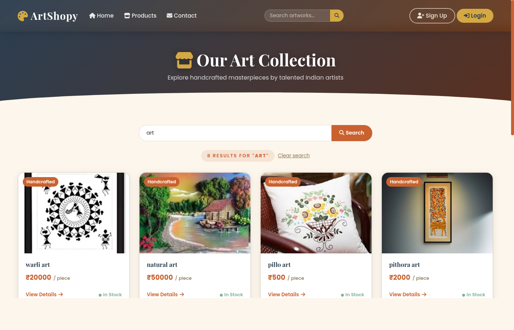
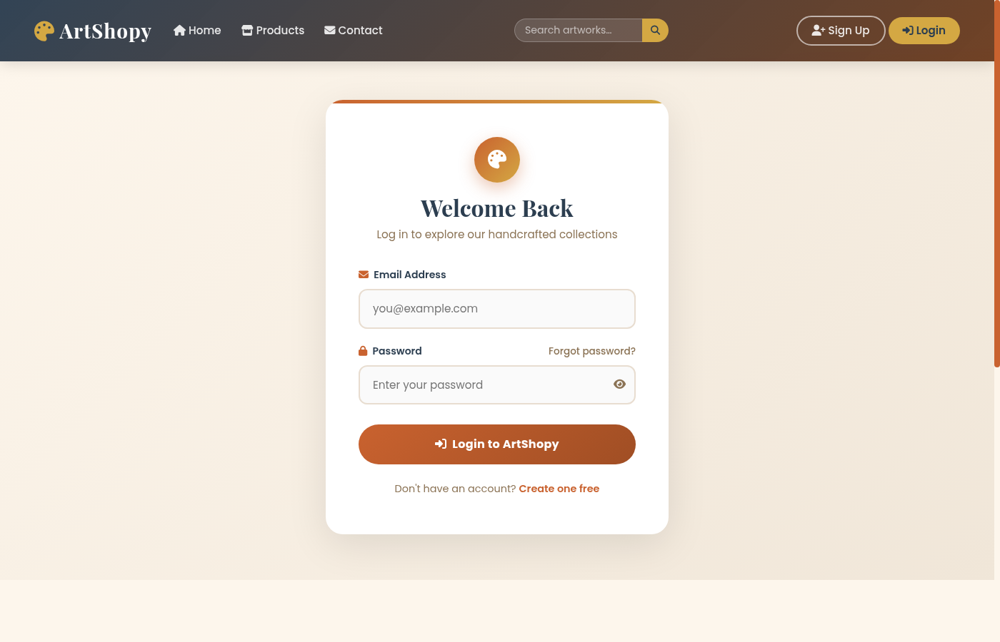
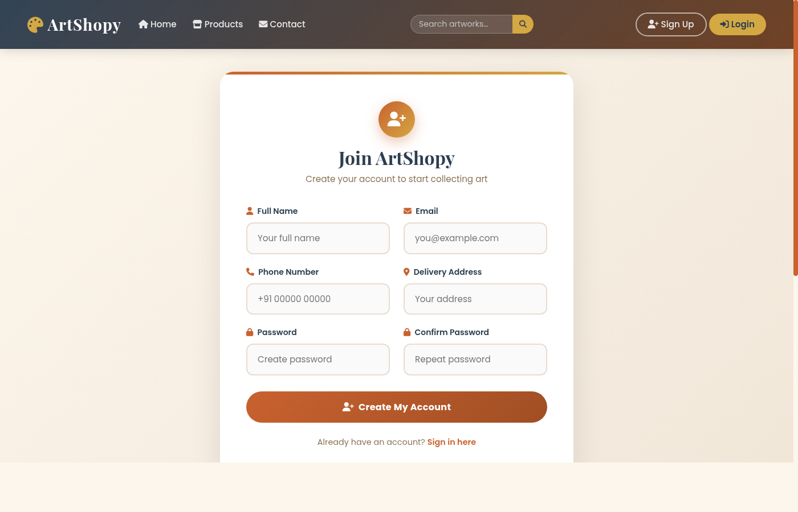

# ArtShopy — Handcrafted Art Store

ArtShopy is a full-featured e-commerce platform built with Django, designed to bring authentic handcrafted Indian artwork directly to collectors. Each piece is carefully curated from talented Indian artists across art forms like Pithora, Lippan Art, Pichwai Paintings, and Madhubani Art.

---

## Tech Stack

| Layer | Technology |
|---|---|
| Backend | Python 3, Django 4.2 |
| Frontend | HTML5, Bootstrap 5, CSS3, JavaScript |
| Database | SQLite3 |
| Payment | Razorpay |
| Email | Gmail SMTP |
| Fonts & Icons | Google Fonts (Playfair Display, Poppins), Font Awesome 6 |

---

## Features

### Shopping
- Browse all artworks with category filters
- **Product Search** — search by name or description from the navbar or products page
- Product detail page with stock status, description, and features

### Cart & Checkout
- **Shopping Cart** — add multiple items with custom quantity, update or remove items
- Live order summary with subtotals and grand total
- Seamless checkout via **Razorpay** payment gateway
- Automatic stock deduction after successful payment

### Wishlist
- Save favourite artworks to a personal wishlist
- Add items directly to cart from the wishlist page
- Wishlist count badge visible in the navbar

### Reviews & Ratings
- Customers can leave a **star rating (1–5)** and written review on any product
- Average rating displayed as a badge on the product detail page
- Users can edit their own review at any time

### User Accounts
- Register, Login, Logout
- Change password
- Forgot password with OTP email verification
- Order history — view all past purchases with transaction details

### Admin Panel (`/admin/`)
- Manage products, categories, users, orders, cart items, wishlist, and reviews
- Search and filter support on all models

---

## Screenshots

### Home Page


### Products Collection


### Search Results


### Login


### Register


### Contact Us


---

## Project Structure

```
django_project/
├── internship/          # Project settings & main URLs
├── app1/
│   ├── models.py        # Category, Product, UserRegister, Ordermodel, Cart, Wishlist, Review
│   ├── views.py         # All view functions
│   ├── urls.py          # URL routing
│   ├── admin.py         # Admin panel config
│   ├── context_processors.py  # Cart & wishlist counts in all templates
│   ├── templates/       # HTML templates
│   └── static/          # CSS & JS assets
├── media/               # Uploaded product & category images
└── screenshots/         # Site screenshots
```

---

Open [http://127.0.0.1:8000](http://127.0.0.1:8000) in your browser.

---

## Key URLs

| URL | Description |
|---|---|
| `/` | Home page |
| `/productcall` | All products |
| `/search/?q=art` | Search results |
| `/productget1/<id>/` | Product detail |
| `/cart/` | Shopping cart |
| `/wishlist/` | Saved wishlist |
| `/my-orders/` | Order history |
| `/login/` | Login |
| `/register/` | Sign up |
| `/contact-us/` | Contact form |
| `/admin/` | Admin panel |

---

## Made with love in India

© 2024 ArtShopy. Crafted to celebrate authentic Indian art.
